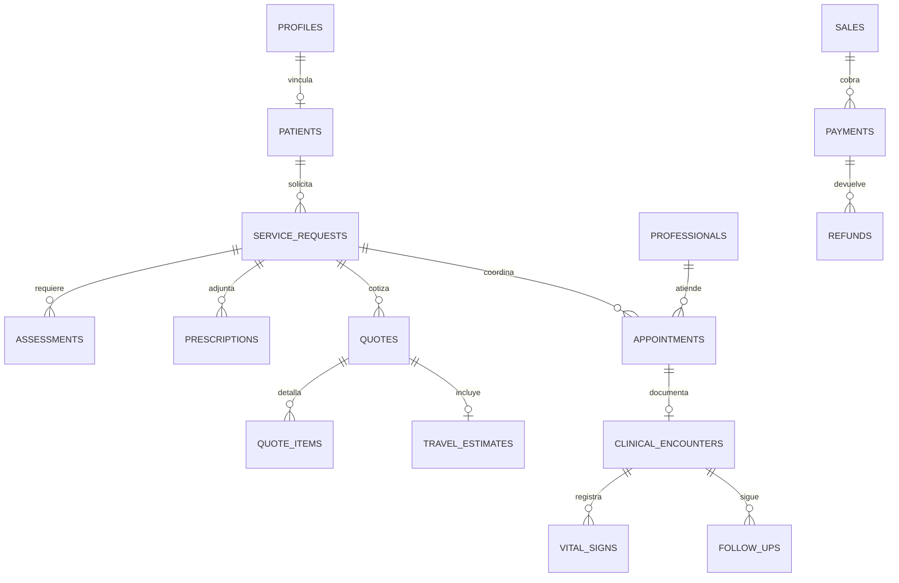

# Instrucciones de construcción de la base de datos

Estado: especificación para implementar. No se han creado ni desplegado tablas.
Fecha: 7 de septiembre de 2026. Proyecto: Pulmocare.

## Objetivo y alcance

Construir una base PostgreSQL administrada con Supabase para las interfaces del paciente,
administración y equipo clínico. Una sola base de negocio por ambiente, con permisos por
identidad y responsabilidad. No crear una base por interfaz.

Ambientes separados: desarrollo local, pruebas y producción. El alcance inicial es una
sola organización Pulmocare. Las empresas contratantes son clientes, no organizaciones
independientes con acceso a expedientes. No introducir multitenencia sin un nuevo requisito.

## Orden de lectura obligatorio

1. [Identidad, pacientes y catálogo](01-identidad-catalogo.md).
2. [Solicitudes y expediente clínico](02-clinica.md).
3. [Agenda, traslados, finanzas y tareas](03-operacion-finanzas.md).
4. [Permisos y acceso a archivos](04-permisos.md).
5. [Migraciones y criterios de aceptación](05-migraciones-validacion.md).
6. [Instrucción para la implementación](06-instruccion-implementacion.md).

Esta carpeta detalla el [modelo conceptual anterior](../datos-y-estados.md).
Para crear SQL, usar los nombres y reglas de esta especificación. Resolver cualquier
diferencia explícitamente; no copiar los tipos simplificados del proveedor de demo.

## Convenciones para todos los módulos

- Tablas y columnas en inglés con snake_case; interfaz y documentación en español.
- Clave primaria id uuid DEFAULT gen_random_uuid(), salvo claves compuestas explícitas.
- created_at timestamptz NOT NULL DEFAULT now(); created_by uuid nullable → profiles.
- updated_at timestamptz y updated_by en tablas editables, actualizados por el servidor.
- Timestamps UTC, presentación America/El_Salvador. Fechas de nacimiento de tipo date.
- FK indexadas cuando se utilicen para joins, autorización o búsquedas.
- NOT NULL por defecto en el diccionario; ? significa nullable. [] significa array.
- ID → tabla indica uuid con FOREIGN KEY a esa tabla, no una cadena sin relación.
- importes *_cents bigint, enteros no negativos; moneda char(3), inicialmente USD.
- Cantidades positivas; ajustes y devoluciones tienen registros propios.
- numeric para valores clínicos y tarifas fraccionarias; no float para dinero.
- Coordenadas: latitude numeric(9,6) y longitude numeric(10,6), en rangos válidos.
- Ambas coordenadas nulas o ambas completas; cero es una coordenada válida.
- Metros y segundos sin redondear para elegir tarifas. Convertir unidades solo al mostrar.
- Estados text con CHECK o catálogo cerrado; enumeraciones documentadas por entidad.
- jsonb solo para cuestionarios versionados, configuración variable y metadatos acotados.
- No almacenar tablas relacionales, expedientes enteros ni signos vitales como un único JSON.
- Sin DELETE CASCADE hacia expedientes, ventas, cotizaciones aceptadas o auditoría.
- Baja operativa mediante estado; la eliminación definitiva tiene un flujo de retención específico.
- Separar datos de contacto y operación de síntomas, diagnósticos y notas clínicas.
- Archivos en Storage privado; en PostgreSQL guardar referencias y metadatos.
- Contraseñas y sesiones a cargo de Supabase Auth. No crear una tabla de contraseñas.
- No guardar tarjetas completas, CVV, claves de API ni tokens privados en tablas de negocio.

## Organización técnica

Tablas de aplicación en public, con RLS y privilegios explícitos desde su creación.
El nombre public no autoriza lectura pública. Usar private para funciones auxiliares
de autorización y tareas internas no expuestas por Data API.
No modificar la estructura administrada de auth.users ni storage.objects.

Publicar únicamente las tablas, columnas y funciones requeridas. Las operaciones complejas
se ejecutan por funciones transaccionales o servidor autenticado, con identidad verificable.
La interfaz nunca decide su rol, patient_id autorizado, precio final ni profesional habilitado.

## Relación principal

El diagrama resume relaciones; el diccionario especifica las FK restantes.

## Entregables esperados de la siguiente etapa

Migraciones SQL por módulo, políticas RLS, funciones transaccionales, índices, semillas
ficticias, pruebas SQL de permisos/concurrencia y tipos TypeScript generados.
La prueba de una migración no equivale a permiso para desplegarla a producción.

## Referencias técnicas

- [RLS y autenticación](https://supabase.com/docs/guides/database/postgres/row-level-security).
- [Datos de usuario](https://supabase.com/docs/guides/auth/managing-user-data).
- [Migraciones locales](https://supabase.com/docs/guides/local-development/database-migrations).
- [Archivos y políticas](https://supabase.com/docs/guides/storage/security/access-control).
- [Restricciones de solapamiento](https://www.postgresql.org/docs/current/rangetypes.html).
